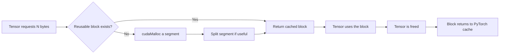
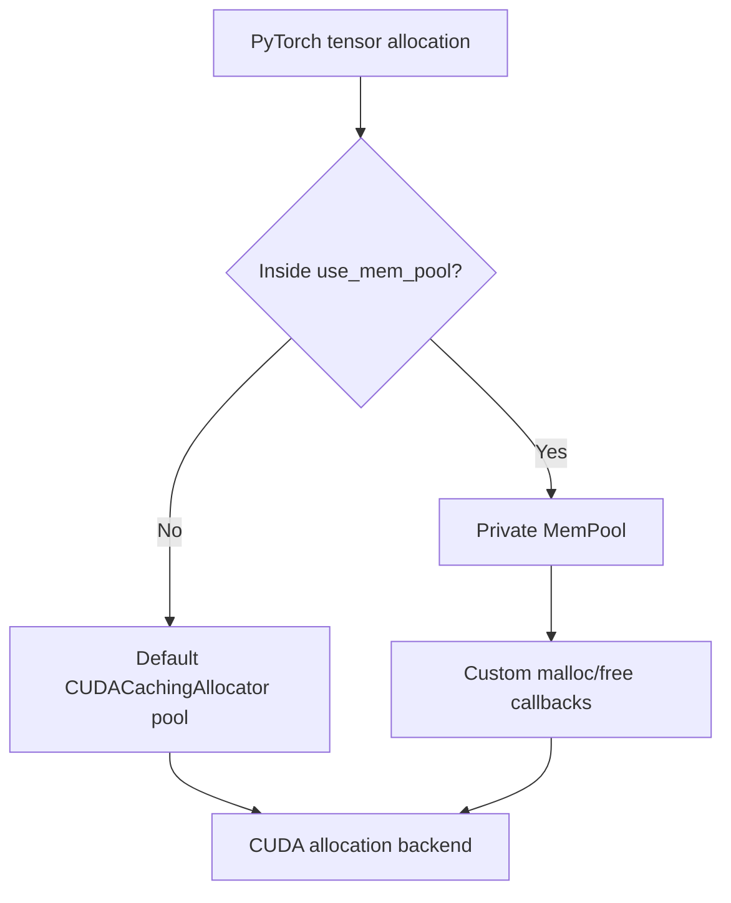
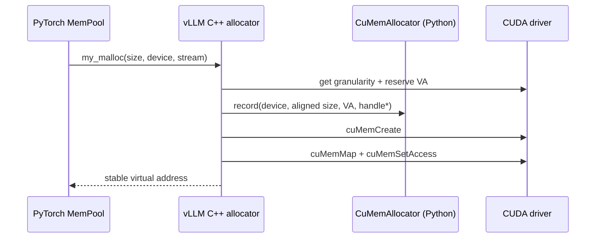
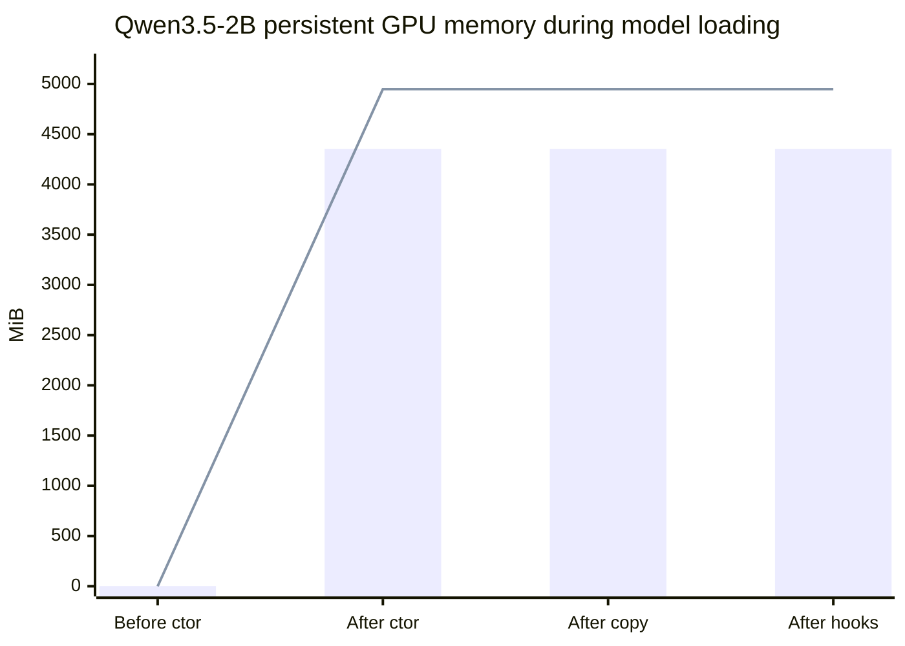

A model loader does more than copy bytes from a checkpoint to a GPU. It must decide **when storage is allocated, which allocator owns it, how checkpoint tensors map to runtime parameters, and whether that storage can later be released without destroying the model**.

This post follows that path in **vLLM v0.27.0**, using a local **Qwen3.5-2B** load on one RTX 2080 Ti as a concrete example. It stops after model weights are loaded; KV-cache allocation and the full Sleep Mode state machine belong to the next post.

> **The central idea:** vLLM does not replace PyTorch's tensor allocator globally. It opens a scoped PyTorch `MemPool` while constructing the model, supplies that pool with a custom CUDA VMM allocator, and tags every pool allocation as `weights`. Checkpoint loading then fills the already-allocated parameter storage in place.
{: .prompt-info }

## 1. The three layers of CUDA memory management

Before reading vLLM, separate three layers that are easy to conflate:

| Layer | Responsibility | Concrete API in this post |
|---|---|---|
| **Tensor storage** | Requests storage for a CUDA tensor | `torch.empty(..., device="cuda")` |
| **PyTorch allocator** | Reuses, splits, and tracks CUDA memory blocks | `CUDACachingAllocator`, `MemPool` |
| **CUDA driver** | Owns virtual addresses and physical device memory | `cuMemAddressReserve`, `cuMemCreate`, `cuMemMap` |

A **virtual address** is the pointer seen by PyTorch and CUDA kernels. **Physical memory** is the actual VRAM backing that address. Ordinary `cudaMalloc` presents both as one operation. CUDA's low-level Virtual Memory Management (VMM) API separates them: reserve an address, create physical memory, map the two, and grant access.[[15](https://developer.nvidia.com/blog/introducing-low-level-gpu-virtual-memory-management)][[16](https://docs.nvidia.com/cuda/cuda-driver-api/group__CUDA__VA.html)]

That separation is the mechanism Sleep Mode will later exploit: physical memory can be unmapped and released while the tensor's virtual address remains stable.

## 2. PyTorch's default: the CUDA caching allocator

Calling `torch.empty` on CUDA normally does **not** imply a fresh `cudaMalloc` for every tensor. PyTorch's native `CUDACachingAllocator` obtains larger **segments** from CUDA, divides them into **blocks**, and reuses free blocks for later tensor allocations. This avoids repeated `cudaMalloc`/`cudaFree` calls and, critically, avoids synchronization on the fast path.[3][22]



Two metrics describe different views of that allocator:

- **`memory_allocated()`**: bytes in blocks currently occupied by live tensors.
- **`memory_reserved()`**: all bytes held by the allocator, including cached free blocks.

Therefore `memory_reserved() >= memory_allocated()`, and `nvidia-smi` may remain high after a tensor is deleted. `empty_cache()` returns **unused cached blocks** to CUDA, but it cannot free storage still owned by a live tensor.[3]

> **Important distinction:** freeing a tensor and releasing VRAM are not the same event. The first ends the tensor's ownership of a block; the second returns physical memory to CUDA.
{: .prompt-tip }

This default policy is excellent for dynamic workloads, but it does not provide vLLM with the operation Sleep Mode needs: “release the physical pages behind these live model tensors, then restore them at the same addresses.”

## 3. PyTorch's extension point: `CUDAPluggableAllocator` and `MemPool`

### 3.1 `CUDAPluggableAllocator`

`CUDAPluggableAllocator` loads two exported functions from a shared library:[3][7]

```cpp
void* my_malloc(ssize_t size, int device, cudaStream_t stream);
void  my_free(void* ptr, ssize_t size, int device, cudaStream_t stream);
```

PyTorch still decides *when* storage is required. The custom functions decide *how* a new allocator segment is obtained and released.

PyTorch can install such an allocator globally with `change_current_allocator()`, but that is process-wide and must happen before the existing allocator is initialized. More importantly, a global swap would route unrelated tensors through the custom policy.[3]

### 3.2 `MemPool`: custom allocation without a global swap

`torch.cuda.MemPool` is a private pool managed by the caching allocator. It can be backed by a custom allocator, while `torch.cuda.use_mem_pool(pool)` routes only allocations in the current thread and context to that pool.[3][10][24]

```python
allocator = torch.cuda.memory.CUDAPluggableAllocator(
    library_path, "my_malloc", "my_free"
)
pool = torch.cuda.memory.MemPool(allocator._allocator)

with torch.cuda.memory.use_mem_pool(pool):
    weights = build_model_on_cuda()  # routed to the private pool

temporary = torch.empty(..., device="cuda")  # default pool again
```

The result is composition rather than replacement:



`MemPool` also preserves useful caching behavior around the custom system allocator. This detail matters for the measured numbers later: the custom allocator sees **segment-sized** requests, not one request for every `nn.Parameter`.[3]

## 4. vLLM's `CuMemAllocator`

vLLM connects that PyTorch extension point to CUDA VMM in two pieces:

- `vllm/device_allocator/cumem.py` owns Python bookkeeping, allocation tags, and sleep/wake operations.[5]
- `csrc/cumem_allocator.cpp` exports `my_malloc` and `my_free`, and calls the CUDA driver.[11]

### 4.1 Allocation: create a stable address and map VRAM into it

For a new segment, `my_malloc` performs the following steps:[11]

1. Query CUDA's allocation granularity with `cuMemGetAllocationGranularity`.
2. Round the requested size up to that granularity.
3. Reserve a virtual address with `cuMemAddressReserve`.
4. Notify the Python callback with an allocation handle:
   `(device, aligned_size, virtual_address, physical_handle_pointer)`.
5. Create physical device memory with `cuMemCreate`.
6. Map it into the reserved address with `cuMemMap`.
7. Grant read/write access with `cuMemSetAccess`.
8. Return the virtual address to PyTorch.



The Python callback stores an `AllocationData` record in `pointer_to_data`, keyed by the virtual address. Each record contains the CUDA handle, a **tag**, an optional CPU backup tensor, and an `is_asleep` flag.[5]

### 4.2 Tags are allocation policy, not tensor metadata

`CuMemAllocator.use_memory_pool(tag)` sets `current_tag`, creates a pluggable allocator and `MemPool`, and enters `torch.cuda.memory.use_mem_pool`. Every **new pool segment** requested inside that scope is recorded with the current tag.[5]

vLLM currently uses two important tags:

- **`weights`**: every CUDA allocation made within the model-loading scope—normally model parameters and persistent buffers, but also any transient/post-load CUDA tensors created there.
- **`kv_cache`**: KV and recurrent-state cache storage created later.

The tag is attached to the allocator's segment record—not to individual `Tensor` objects. It is therefore **scope-based, not type-based**: one tagged segment can contain many parameter blocks, and a non-parameter allocation made inside `load_model` receives the same `weights` tag.

### 4.3 Why stable virtual addresses matter

On sleep, vLLM can copy selected allocations to CPU, call `cuMemUnmap`, and release their physical handles. The virtual address reservation—and therefore every tensor pointer—remains known. Wake-up creates new physical memory and maps it back at the same address before copying saved bytes back.[5][11]

That gives the model object an unusual lifetime:

```text
nn.Parameter object:     alive ───────────────────────────── alive
CUDA virtual address:   reserved ───────────────────────── reserved
physical VRAM backing:  mapped ── released ── mapped again
weight contents:         GPU ───── CPU backup ─ GPU
```

This post focuses on how the first `mapped` state is created. The next post will follow the release and restoration paths.

## 5. The complete vLLM model-loading path

The key scope is only a few lines in `GPUWorker.load_model`:[6]

```python
with (
    self._maybe_get_memory_pool_context(tag="weights"),
    set_current_vllm_config(self.vllm_config),
    self._scoped_allocator_max_split(max_split_size_mb=20),
):
    self.model_runner.load_model()
```

When Sleep Mode is enabled, model configuration automatically enables the CuMem allocator. `_maybe_get_memory_pool_context("weights")` then returns `CuMemAllocator.use_memory_pool(tag="weights")`; otherwise it returns a no-op context.[6]

Everything below happens inside that scope.

### Phase 1 — Construct the runtime model directly on CUDA

`BaseModelLoader.load_model` selects the target CUDA device and default dtype, then calls `initialize_model` inside the device context.[23]

```python
with set_default_torch_dtype(model_config.dtype):
    with target_device:
        model = initialize_model(...)
```

The device context changes the default device for factory calls. Consequently, constructors such as `torch.empty(...)` inside embeddings, linear layers, and norms allocate parameter storage **directly on CUDA**. There is no full CPU model followed by `model.to("cuda")` in the ordinary, unquantized path.

For Qwen3.5, the runtime class is `Qwen3_5ForConditionalGeneration`. It constructs the vision tower and the `Qwen3_5ForCausalLM` language model; the latter constructs embeddings and 24 decoder layers. Several checkpoint tensors are packed into fused runtime parameters—for example separate GDN projections are mapped into `in_proj_qkvz` and `in_proj_ba`.[17]

At the end of construction:

- CUDA storage for all runtime parameters already exists.
- The storage contains uninitialized values.
- Every private-pool segment allocated so far is tagged `weights`.

> **Common misconception:** checkpoint loading is not where ordinary GPU parameter storage is first allocated. The model constructor allocates the destination; checkpoint loading fills it.
{: .prompt-warning }

### Phase 2 — Memory-map the checkpoint on CPU

The default safetensors strategy opens each checkpoint with `safe_open(..., framework="pt")` and yields one CPU tensor at a time. On a local filesystem, this is lazy, memory-mapped loading rather than an eager copy of the entire file into anonymous CPU RAM.[19]

The local checkpoint reports **4,548,144,832 bytes (4.236 GiB)** of tensor payload in `model.safetensors.index.json`.

### Phase 3 — Map checkpoint names to runtime parameters

`Qwen3_5ForConditionalGeneration.load_weights` delegates to `AutoWeightsLoader`. The loader recursively follows module and parameter names, applies Qwen3.5's name/packing mapper, and selects a parameter-specific `weight_loader` when present.[17][18]

This is where vLLM handles differences between checkpoint layout and runtime layout:

- fused Q/K/V or gate/up projections,
- tensor-parallel slices,
- packed quantized formats,
- skipped pipeline stages,
- tied embeddings.

The output is not a second model. It is a stream of source tensors matched to existing destination parameters.

### Phase 4 — Copy into existing GPU storage

The ordinary loader eventually performs:

```python
param.data.copy_(loaded_weight)
```

The source tensor is CPU-backed; `param` already points into the `weights` MemPool on CUDA. `copy_` transfers bytes into that existing address. It does **not** replace the parameter or allocate another full-sized CUDA destination.[19]

After each source tensor has been copied, the generator advances and the previous CPU tensor view can be released. This keeps host-side loading incremental.

### Phase 5 — Post-process and leave the pool scope

After all checkpoint tensors are copied, vLLM validates that required parameters were loaded, runs quantization- and attention-specific post-load hooks, and returns `model.eval()`.[12][13][23]

When `GPUWorker.load_model` exits `use_memory_pool("weights")`, normal allocations return to the default PyTorch pool. The model tensors, however, retain their private-pool storage. vLLM also keeps strong references to the `MemPool` and `CUDAPluggableAllocator`, because their lifetime must exceed the tensors and any captured CUDA graphs.[5]

## 6. Qwen3.5-2B: measured allocation timeline

### 6.1 Reproduction setup

The run used:

| Item | Value |
|---|---|
| vLLM | `v0.27.0` (`4bdc8a7`) |
| PyTorch | `2.13.0+cu130` |
| GPU | NVIDIA GeForce RTX 2080 Ti, 11 GiB |
| Model | local Qwen3.5-2B snapshot |
| Runtime dtype | FP16 |
| Tensor parallelism | 1 |
| Execution | eager, single worker process |
| Checkpoint | one safetensors shard, 4.236 GiB payload |

I instrumented four boundaries in the real vLLM loader and read both PyTorch allocator counters and `CuMemAllocator.pointer_to_data`. The values below are from that run, not estimates.

### 6.2 What happened

| Boundary | Live tensor bytes | Reserved by PyTorch | Tracked by CuMem | CuMem segments | Total CUDA used |
|---|---:|---:|---:|---:|---:|
| Before model constructor | 2.04 MiB | 22 MiB | 0 MiB | 0 | 1,216.69 MiB |
| After model constructor | 4,352.01 MiB | 4,970 MiB | 4,948 MiB | 125 | 6,164.69 MiB |
| After checkpoint copy | 4,352.01 MiB | 4,970 MiB | 4,948 MiB | 125 | 6,164.69 MiB |
| After post-load hooks | 4,352.00 MiB | 4,970 MiB | 4,948 MiB | 125 | 6,164.69 MiB |

vLLM's built-in log agreed with the live tensor delta:

```text
Loading weights took 3.44 seconds
Model loading took 4.25 GiB memory and 3.788477 seconds
```

The table reveals the entire loading mechanism:

1. **The constructor allocated the GPU destination.** CUDA usage rose by exactly **4,948 MiB**, equal to the bytes tracked by CuMem.
2. **Checkpoint copy allocated no additional persistent GPU memory.** All three counters stayed flat while 4.236 GiB of safetensors payload was copied into the existing parameters.
3. **Live runtime tensors occupied 4,352 MiB.** This is only **14.56 MiB** above the checkpoint payload, reflecting runtime-only buffers and layout differences.
4. **PyTorch reserved 4,970 MiB for the private pool.** About **618 MiB** was cached capacity rather than live tensor data.
5. **CuMem tracked 4,948 MiB, not 4,352 MiB.** vLLM's CUDA VMM callback allocates the backing segments requested by `MemPool`; the 125 segments include allocator rounding and granularity. The ten largest were 970, 256, 128, 128, 128, and five 48 MiB segments.



The bars are live tensor bytes; the line is CuMem-tracked physical backing.

> **Why is total CUDA usage higher?** The CUDA context, NCCL, kernels, and other libraries allocate memory outside PyTorch's tagged weight pool. vLLM intentionally initializes distributed state before its baseline snapshot. Those bytes remain real, but they are not model-weight storage and should not be attributed to the checkpoint.[6][20]
{: .prompt-info }

## 7. What vLLM actually owns

The cleanest mental model is to assign each responsibility to the correct layer:

| Question | Owner |
|---|---|
| What parameters exist, with what shapes? | vLLM model implementation |
| When is parameter storage requested? | PyTorch module constructors |
| Which requests enter the weight pool? | `GPUWorker`'s scoped `use_memory_pool("weights")` |
| How are pool segments cached and split? | PyTorch `MemPool` / `CUDACachingAllocator` |
| How is each new segment backed? | vLLM `my_malloc` using CUDA VMM |
| How are checkpoint names transformed? | Qwen3.5 mapping + `AutoWeightsLoader` |
| How do checkpoint bytes reach the GPU? | parameter-specific loaders and `copy_` |
| How can VRAM later disappear without deleting parameters? | vLLM unmaps physical backing while retaining virtual addresses |

This division explains why the implementation is small at the integration point but powerful in effect. vLLM lets PyTorch continue constructing normal CUDA tensors; it changes only the backing policy for allocations made inside two carefully chosen scopes.

## 8. Takeaways

- **PyTorch's default CUDA allocator caches memory** to avoid synchronization and repeated CUDA calls.
- **`CUDAPluggableAllocator` defines segment allocation**, while **`MemPool` limits that policy to a scope** and retains caching behavior.
- **vLLM's CuMem allocator uses CUDA VMM**, separating stable virtual addresses from releasable physical VRAM.
- **Model construction allocates the GPU destinations; checkpoint loading copies into them.** For the measured Qwen3.5-2B run, persistent GPU counters were flat during the checkpoint copy itself.
- **`weights` is a segment-level policy tag.** It gives Sleep Mode a complete inventory of which physical allocations must be backed up or discarded.
- **Checkpoint size, live tensor bytes, PyTorch-reserved bytes, CuMem-tracked bytes, and total process VRAM are different quantities.** Treating them as interchangeable is the fastest way to misread a memory log.

The next post will start from the final state shown here and trace `sleep(level=1)`, `sleep(level=2)`, and `wake_up`: which mappings are removed, which bytes are copied to CPU, and why the original tensor pointers remain valid.

## Sources

- [3] [PyTorch CUDA semantics: CUDA memory management](https://docs.pytorch.org/docs/stable/notes/cuda.html)
- [5] [vLLM v0.27.0 `cumem.py`](https://github.com/vllm-project/vllm/blob/v0.27.0/vllm/device_allocator/cumem.py)
- [6] [vLLM v0.27.0 GPU worker](https://github.com/vllm-project/vllm/blob/v0.27.0/vllm/v1/worker/gpu_worker.py)
- [7] [PyTorch `CUDAPluggableAllocator` API](https://docs.pytorch.org/docs/stable/generated/torch.cuda.memory.CUDAPluggableAllocator.html)
- [10] [PyTorch 2.13 CUDA memory Python source](https://raw.githubusercontent.com/pytorch/pytorch/v2.13.0/torch/cuda/memory.py)
- [11] [vLLM v0.27.0 CuMem C++ allocator](https://github.com/vllm-project/vllm/blob/v0.27.0/csrc/cumem_allocator.cpp)
- [12] [vLLM v0.27.0 default model loader](https://github.com/vllm-project/vllm/blob/v0.27.0/vllm/model_executor/model_loader/default_loader.py)
- [13] [vLLM v0.27.0 model loader utilities](https://github.com/vllm-project/vllm/blob/v0.27.0/vllm/model_executor/model_loader/utils.py)
- [15] [NVIDIA: Introducing Low-Level GPU Virtual Memory Management](https://developer.nvidia.com/blog/introducing-low-level-gpu-virtual-memory-management)
- [16] [CUDA Driver API: Virtual Memory Management](https://docs.nvidia.com/cuda/cuda-driver-api/group__CUDA__VA.html)
- [17] [vLLM v0.27.0 Qwen3.5 model](https://github.com/vllm-project/vllm/blob/v0.27.0/vllm/model_executor/models/qwen3_5.py)
- [18] [vLLM v0.27.0 `AutoWeightsLoader`](https://github.com/vllm-project/vllm/blob/v0.27.0/vllm/model_executor/models/utils.py)
- [19] [vLLM v0.27.0 weight utilities](https://github.com/vllm-project/vllm/blob/v0.27.0/vllm/model_executor/model_loader/weight_utils.py)
- [20] [vLLM v0.27.0 memory profiler utilities](https://github.com/vllm-project/vllm/blob/v0.27.0/vllm/utils/mem_utils.py)
- [22] [A guide to PyTorch's CUDA Caching Allocator](https://zdevito.github.io/2022/08/04/cuda-caching-allocator.html)
- [23] [vLLM v0.27.0 base model loader](https://github.com/vllm-project/vllm/blob/v0.27.0/vllm/model_executor/model_loader/base_loader.py)
- [24] [PyTorch `MemPool` API](https://docs.pytorch.org/docs/stable/generated/torch.cuda.memory.MemPool.html)
